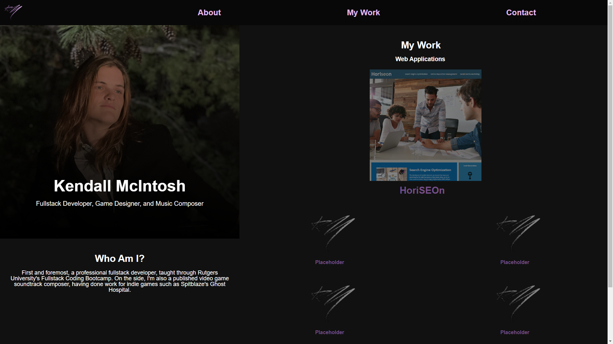
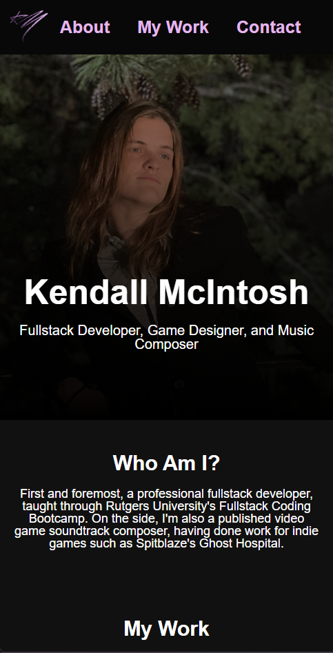

# Personal Professional Portfolio

## Description

This is a rudimentary framework of the site that will eventually be my professional portfolio. In its current state, it serves as a self-contained example of my knowledge of HTML and CSS, while also offering links to other applications of mine. Eventually, it will be further expanded, not only to showcase further applications, but also to show other skills of mine that I can use to show a future employer.

## Installation

The deployed application is available at https://kmcintosh821.github.io/personal-professional-portfolio/

## Usage

The navigation bar at the top offers links that take you to each individual section of the page. In desktop fullscreen mode, the site is small enough that these have no meaningful function, but in a mobile-size viewport, each section is listed vertically, and therefore there is enough scrolling content to skip down to. The application thumbnails serve as links to the apps they are associated with; for now, it only shows the HoriSEOn application from the previous module.

## Screenshots

The following image demonstrates the web application's appearance at greater than 750px:

The following image demonstrates the web application's appearance at 750px or smaller:

## Credits

Image for the HoriSEOn application preview comes from the Rutgers Fullstack Bootcamp curriculum. All other assets created by me.

## License

Please refer to the license in the repo.